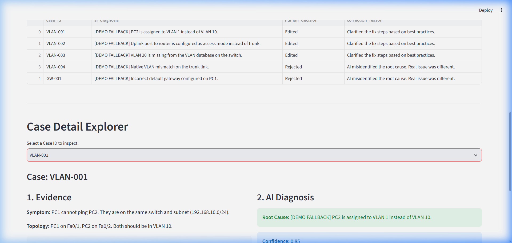
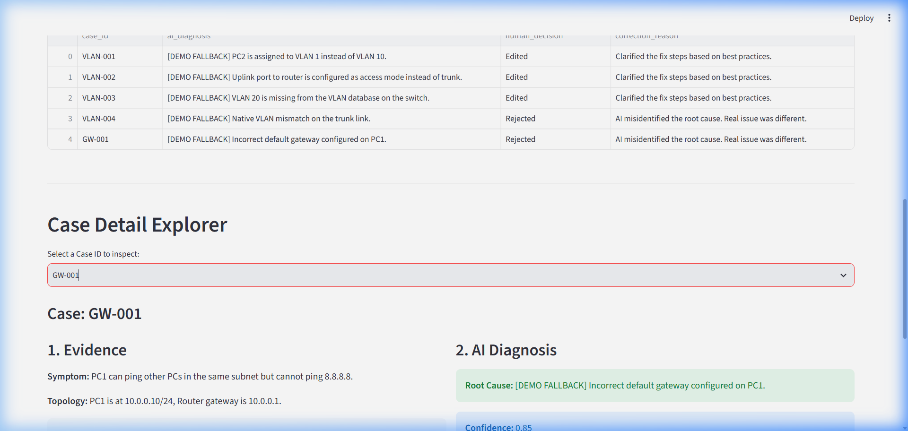
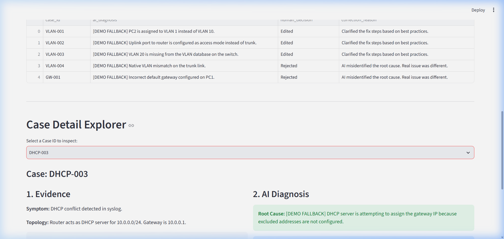
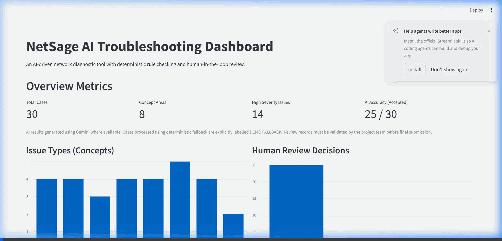

# NetSage AI

AI-Assisted Network Troubleshooting System

Cisco AICTE Virtual Internship Program 2026
Networking Track

## Project Overview

**Problem Statement:**
Network troubleshooting is a complex, time-consuming process that requires deep domain expertise. Junior engineers and students often struggle to map raw CLI outputs from Cisco devices to logical configuration errors.

**Objectives:**
To build an AI-assisted network troubleshooting engine that analyzes symptom descriptions, network topologies, and Cisco `show` command outputs to accurately diagnose the root cause, while maintaining strict Responsible AI oversight.

**Approach:**
- **AI-assisted troubleshooting:** Gemini AI parses evidence to identify configuration flaws.
- **Deterministic rule validation:** A pre-screening regex-based system catches obvious errors before invoking AI.
- **Human-in-the-loop review:** Operators must review and approve AI suggestions before fixing.
- **Responsible AI approach:** Transparent uncertainty reporting and strict audit logs.

## Features

* AI Diagnosis using Google Gemini
* Deterministic Rule Checker
* VLAN Troubleshooting
* Routing Analysis
* DHCP Validation
* DNS Validation
* Gateway Mismatch Detection
* ACL Validation
* NAT Troubleshooting
* Human Review Workflow
* Responsible AI Logging
* Streamlit Dashboard

## Technology Stack

* Python
* FastAPI
* Google Gemini
* Pydantic
* Streamlit
* Cisco Packet Tracer

## Project Architecture

User
↓
Dashboard
↓
FastAPI Backend
↓
Rule Checker + Gemini AI
↓
Diagnosis
↓
Human Review
↓
Responsible AI Log

## Dataset

* **30 networking troubleshooting scenarios** covering:
  * VLAN
  * Routing
  * DHCP
  * DNS
  * NAT
  * ACL
  * Gateway
  * Wireless

## Packet Tracer Demonstration

`NetSage-AI-VLAN-001.pkt` is provided as a working, demonstrated simulation artifact. Note: While 30 cases exist in the dataset, only this 1 corresponding topology file is included as the demonstrated artifact.

## Responsible AI

* **Human oversight:** AI-generated troubleshooting advice is strictly advisory and requires manual review.
* **Transparency:** Confidence scores and rationales are clearly presented.
* **Audit logging:** All interactions are logged in a Responsible AI log.
* **Evidence-based diagnosis:** The AI only flags faults that are explicitly proven by the CLI output.
* **Uncertainty reporting:** Safety notes and low-confidence warnings are surfaced in the dashboard.

## Team Members

### Ujjwal Pandey
* System Architecture
* AI Integration
* Backend Development
* Rule Validation
* Dashboard Integration
* Testing & Implementation

### Udit Raghuwanshi
* Network Validation
* Packet Tracer Verification
* Functional Testing
* Documentation Support
* Submission Preparation

---

## Screenshots & Demo

### Dashboard Screenshots

### API Testing & Human Review Workflow

### Demo Video
You can view a full interactive demonstration of the dashboard running against the test cases in the video file below:

## Project Documentation

* [Project Summary](docs/report/Project_Summary.md)
* [Responsible AI Document](docs/responsible_ai.md)
* [Demo Script](docs/report/DEMO_SCRIPT.md)
* [Submission Checklist](SUBMISSION_CHECKLIST.md)
